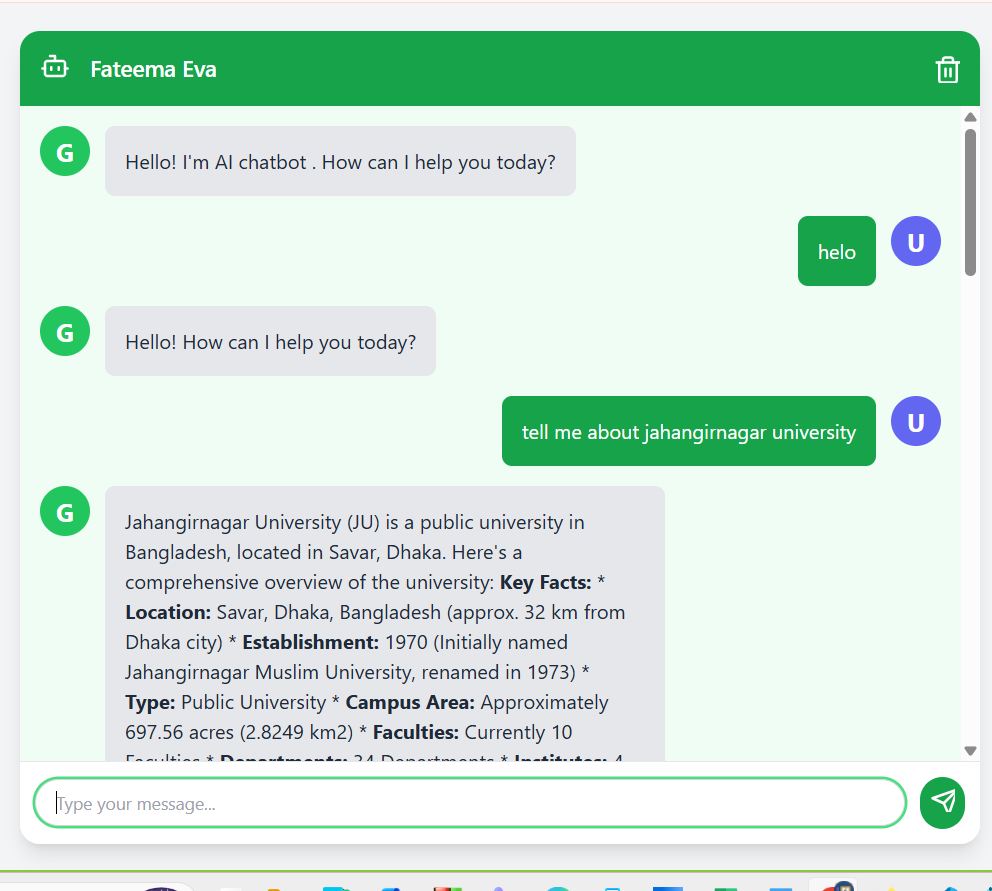

# 🧠 API-Based Chatbot (Gemini API)

An interactive **Cloud API** based chatbot built using **HTML**, **CSS**, and **JavaScript**.  


## 🚀 Features
- 💬 Real-time AI-powered chat using **Cloud API** 
- 🕒 Persistent chat history (saved in `localStorage`)  
- 🧹 “Clear Chat” button to reset conversation  
- 🌗 Clean and responsive UI  


---

## 🧩 Tech Stack
- **Frontend:** HTML, CSS, JavaScript  
- **API:** Google Gemini API (REST)  
- 

---

## 🖼️ Screenshot
  


## ⚙️ How to Run
```bash
# Clone this repository
git clone https://github.com/your-username/api-based-chatbot.git
cd api-based-chatbot

# Open the project
# Simply open index.html in your browser

